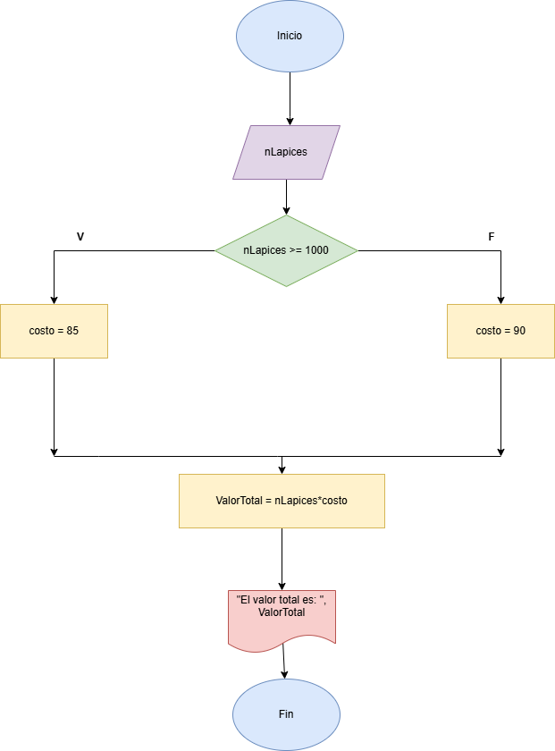
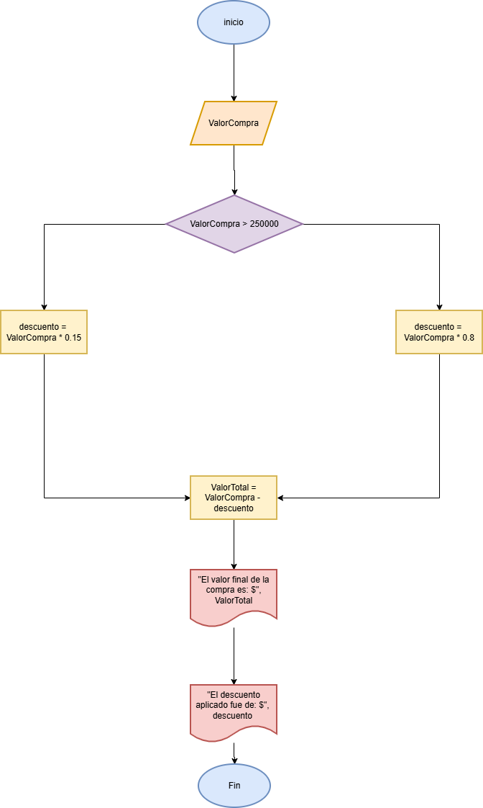

# ### Realice un algoritmo para determinar cuánto se debe pagar por equis cantidad de lápices considerando que si son 1000 o más el costo es de $85 cada uno; de lo contrario, el precio es de $90. Represéntelo con el pseudocódigo y el diagrama de flujo

**Pseudocódigo:**

```pseudo
Inicio
Leer nLapices
Si nLapices >= 1000
    Hacer costo = 85
Si no
    Hacer costo = 90
Fin Si
Hacer valorTotal = nLapices * costo
Escribir "El valor total de los lápices es: ", valorTotal
Fin
```

**Diagrama de flujo**



**codigo** 

```py
nLapices = int(input("Ingresa la cantidad de lápices a comprar: "))

if nLapices >= 1000:
    total = 85 * nLapices
else:
    total = 90 * nLapices
print("El valor de los lápices es: $", total)
```

# Un almacén de ropa tiene una promoción: por compras superiores a $250 000 se les aplicará un descuento de 15%, de caso contrario, sólo se aplicará un 8% de descuento. Realice un algoritmo para determinar el precio final que debe pagar una persona por comprar en dicho almacén y de cuánto es el descuento que obtendrá. Represéntelo mediante el pseudocódigo y el diagrama de flujo.

**Pseudocódigo:**

```pseudo
Inicio
Leer valorCompra
Si valorCompra > 250000
    Hacer descuento = valorCompra * 0.15
Si no
    Hacer descuento = valorCompra * 0.08
Hacer valorFinal = valorCompra - descuento
Escribir "El valor final de la compra es: $", valorFinal
Escribir "El descuento fue de: $", descuento
Fin
```

**Diagrama de flujo** 



**codigo** 
```py
valorCompra = int(input("Ingrese el valor de la compra: "))

if valorCompra > 250000:
    descuento = valorCompra * 0.15
else:
    descuento = valorCompra * 0.08

valorFinal = valorCompra - descuento

print("El valor final de la compra es:", valorFinal, "y el descuento aplicado fue de:", descuento)
```
### El director de una escuela está organizando un viaje de estudios, y requiere determinar cuánto debe cobrar a cada alumno y cuánto debe pagar a la compañía de viajes por el servicio. La forma de cobrar es la siguiente: si son 100 alumnos o más, el costo por cada alumno es de $65.00; de 50 a 99 alumnos, el costo es de $70.00, de 30 a 49, de $95.00, y si son menos de 30, el costo de la renta del autobús es de $4000.00, sin importar el número de alumnos

**Pseudocódigo:**

```pseudo
Inicio
Leer nAlumnos
Si nAlumnos < 30
    total = 4000
    precio = total / nAlumnos
Si no
    Si nAlumnos < 50
        precio = 95
    Si no
        Si nAlumnos < 100
            precio = 70
        Si no
            precio = 65
        Fin si
    Fin si
    total = precio * nAlumnos
Fin si
Escribir precio, total
```

