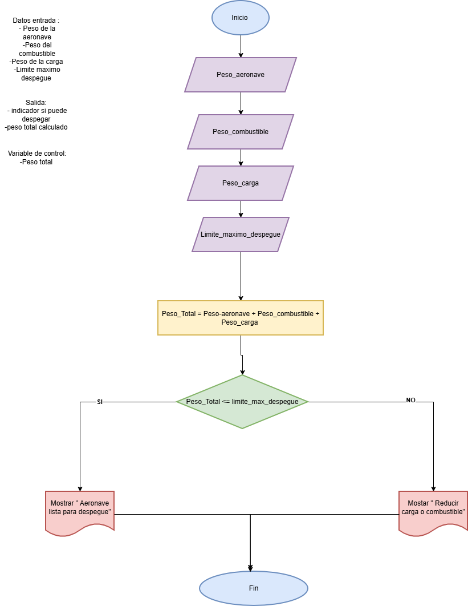
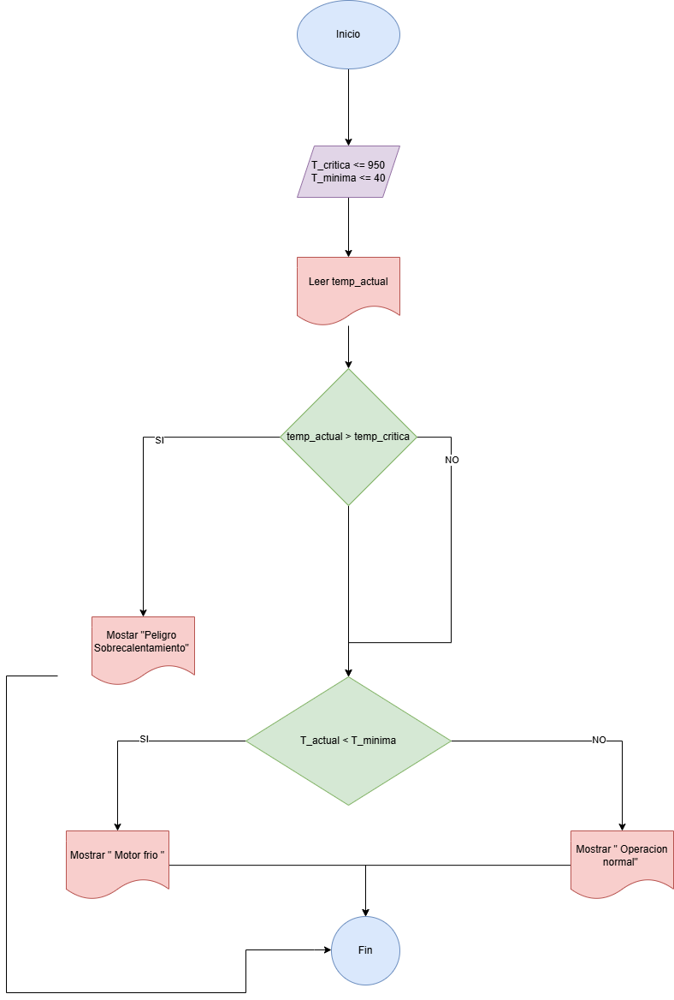

### Ejercicios con condicionales

 # Verificación de peso de despegue
    
 ## En una pista de pruebas de aeronaves, el sistema debe verificar si el peso total de la aeronave, incluyendo combustible y carga,    supera el límite máximo permitido para el despegue. Dependiendo del resultado, el sistema deberá indicar si la aeronave está lista  para despegar o si debe reducir carga o combustible.


### Analisis
1. variables de entrada 
    - peso maximo
    - peso actual 

2. variables de salida 
    - Aeronave lista para despegar 
    - Alerta reducir carga o combustible 


### Pseudocodigo   
```pseudo
Inicio
    Escribir "Ingrese el peso actual de la aeronave (kg):"
    Leer peso_actual
    Escribir "Ingrese el peso máximo permitido (kg):"
    Leer peso_maximo
    
    Si peso_actual <= peso_maximo Entonces
        Escribir "Estado: Aeronave lista para despegar."
    Sino
        Escribir "Estado: Alerta. Debe reducir carga o combustible."
    FinSi
Fin
```

### Diagrama de flujo 



# Control de temperatura del motor
    
## Durante una inspección de rutina, se mide la temperatura de un motor de turbina. Si la temperatura es mayor a un valor crítico, se debe indicar "Peligro: sobrecalentamiento". Si está dentro del rango seguro, indicar "Operación normal". Si es demasiado baja, indicar "Motor frío – Calentar antes de operar".

### Analisis 

1. variables de entrada
    - temperatura motor 
    
    variable de salida 
    - estado_motor  

    constantes 
    - temperatura critica 
    - temperatura minima

    Otras variables 
    N/A

### Pseudocodigo 

```Pseudo
incio 
    Temperatura_critica <= 950 
    Temperatura_minima <= 40 

    Escribir "Ingrese la temperatura medida del motor de turbina:" 
    leer temperatura_actual 

    Si temp_actual > T_CRITICA Entonces
        estado_motor <- "Peligro: sobrecalentamiento"
    Sino
        Si temperatura_actual < Temperatura_minima Entonces 
            estado_motor = "motor frio - Calentar antes de operar" 
        Sino 
            estado_motor = "Operacion normal"
        Finsi
    Finsi

    Escribir "Estado del sistema: ", estado_motor 
Fin 
```





# Registro de altitudes de vuelo
    
# Un sistema debe registrar la altitud de vuelo cada 10 minutos durante una hora y mostrar todas las mediciones al final.

## analisis 

1. Variables de entrada 
    - altitud ingresada 
2. Variable de salida 
    - lista de altitudes 
3. Constantes 
    - Tiempo total 
4. Otras variables 
    - i 

### Pseudocodigo 

```Pseudo 

Inicio
    MAX_LECTURAS = 6
    
    Escribir "Iniciando registro de altitudes (1 hora)..."
    
        Para i = 1 Hasta MAX_LECTURAS Con Paso 1 Hacer
        Escribir "Medición ", i, " - Ingrese altitud (ft):"
        Leer altitud
        
        Escribir "Registrado: ", altitud, " ft a los ", i * 10, " minutos."
    FinPara
    
    Escribir "Proceso de registro finalizado."
Fin
```

# Control de combustible en pruebas
# Durante un ensayo en banco de un motor a reacción, se mide el nivel de combustible cada minuto y se detiene el registro cuando el combustible baja del 10%. Mostrar el tiempo total de operación antes de llegar a ese punto.

1. Variable de entrada 
    - nivel de combustible

2. Variable de salida 
    - Tiempo total 

3. Constantes 
    - Limite de seguridad 

4. Otras variables 
    - N/A

### Pseudocodigo 

```Pseudo 
Inicio

    LIMITE_SEGURIDAD = 10
    tiempo_total = 0
    
    Escribir "Ingrese el nivel inicial de combustible (%):"
    Leer nivel_combustible
    
    Mientras nivel_combustible >= LIMITE_SEGURIDAD Hacer
        tiempo_total = tiempo_total + 1
        
        Escribir "Minuto ", tiempo_total, ": Operación estable."
        Escribir "Ingrese el nuevo nivel de combustible (%):"
        Leer nivel_combustible
    FinMientras
    

    Escribir " PRUEBA FINALIZADA "
    Escribir "El motor operó durante ", tiempo_total, " minutos antes de llegar al límite crítico."
Fin
```

### Ejercicios con bucle y condicionales

# Detección de turbulencia en trayecto
# Un sensor mide la aceleración vertical de la aeronave en intervalos de un segundo durante un trayecto de 2 minutos. Si el valor medido supera un umbral, indicar que se ha detectado turbulencia en ese instante. Al final, mostrar cuántas turbulencias se detectaron.

## analisis 

1. Variable entrada 
    - aceleracion 
    - limite aceleracion 

2. variable salida 
    - total turbulencia 

3. otras variables 
    - segundos 

4. Constantes 
    - tiempo maximo 

### Pseudocodigo 

```Pseudo

Inicio

    total_turbulencias = 0
    
    Escribir "Configuración del Sistema de Vuelo"
    Escribir "Defina el umbral de aceleración para turbulencia (m/s2):"
    Leer limite_aceleracion 
    
    Escribir "Monitoreo iniciado por 120 segundos..."
    
    Para segundo = 1 Hasta 120 Con Paso 1 Hacer
        Escribir "Segundo ", segundo, " - Aceleración detectada:"
        Leer aceleracion
        
        Si aceleracion > umbral_piloto Entonces
            Escribir " ALERTA: Turbulencia detectada "
            total_turbulencias = total_turbulencias + 1
        FinSi
    FinPara
    
    Escribir " FIN DEL TRAYECTO "
    Escribir "Eventos totales registrados: ", total_turbulencias
Fin
```
# Control de temperatura en cabina
# Un sistema mide cada 5 minutos la temperatura en cabina durante una hora. Si en algún momento se detecta una temperatura mayor a 27°C o menor a 18°C, debe indicar que se active el sistema de climatización.

## analisis

1.  Variable de entrada 
    - temp_cabina 
    Variable de salida 
    - N/A
    Constantes 
    - Temp_MAX
    - Temp_MIN
    Otras variables 
    - i 

### Pseudocodigo 
```Pseudo
Inicio
    T_MAX = 27
    T_MIN = 18
    
    Escribir "Iniciando monitoreo de cabina (12 vueltas)..."

    Para i = 1 Hasta 12 Con Paso 1 Hacer
        Escribir "Medición minuto ", i * 5, ". Ingrese temperatura (°C):"
        Leer temp_cabina
        
        Si temp_cabina > T_MAX OR temp_cabina < T_MIN Entonces
            Escribir " ALERTA: Activar sistema de climatización "
        Sino
            Escribir "Temperatura estable."
        FinSi
    FinPara
    
    Escribir "Monitoreo de la hora finalizado."
Fin
```
#   Simulación de conteo de pasajeros
#   Durante el abordaje, un sistema cuenta a los pasajeros que ingresan. Si el número total supera la capacidad máxima, el sistema debe detener el conteo y mostrar un mensaje de alerta.

## analisis 

1. Variable de entrada 
    - ingreso 
2. Variable de salida 
    - Conteo_total 
3. Constantes 
    - Capacidad_MAX 

### Pseudocodigo 

```Pseudo

Inicio

    CAPACIDAD_MAX = 150
    conteo_total = 0
    
    Escribir "SISTEMA DE ABORDAJE INICIADO"
    Escribir "Capacidad máxima permitida: ", CAPACIDAD_MAX
    
      Mientras conteo_total < CAPACIDAD_MAX Hacer
        Escribir "Pasajeros actuales: ", conteo_total
        Escribir "Ingrese cantidad de personas entrando por la puerta:"
        Leer ingreso
        
        conteo_total = conteo_total + ingreso
        
        Si conteo_total > CAPACIDAD_MAX Entonces
            Escribir " ALERTA: CAPACIDAD EXCEDIDA "
            Escribir "Pasajeros en exceso: ", (conteo_total - CAPACIDAD_MAX)
        FinSi
    FinMientras
    
    // 3. Resultado final
    Escribir " PROCESO DE ABORDAJE CERRADO "
    Escribir "Total de pasajeros a bordo: ", conteo_total
Fin
```
